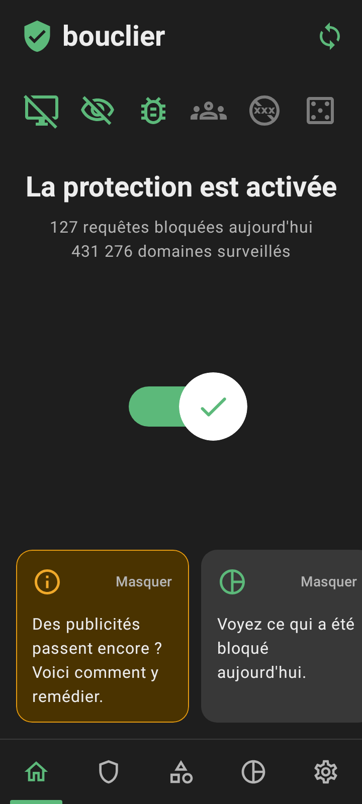
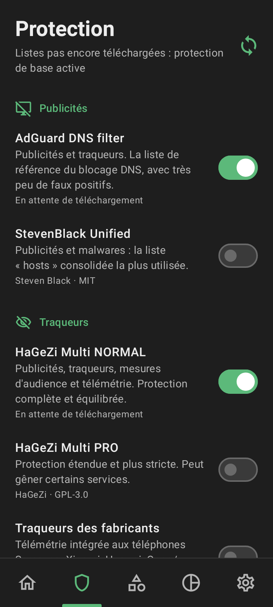
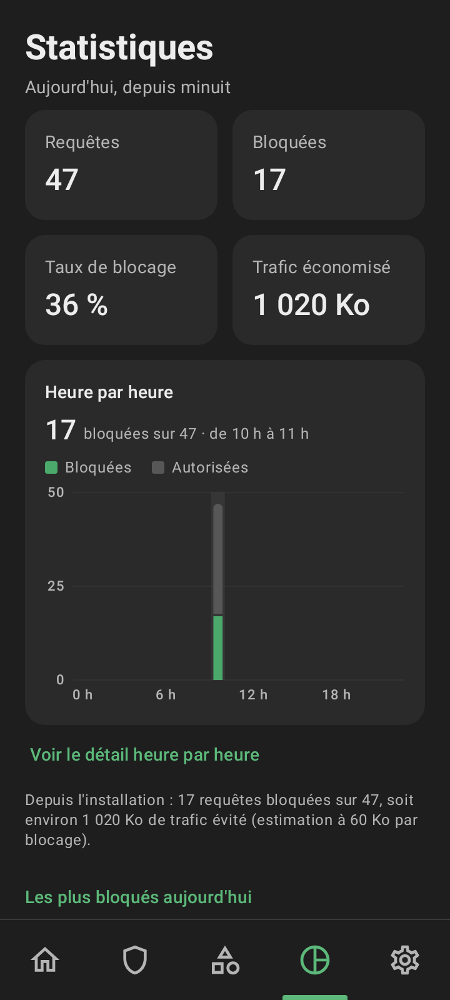
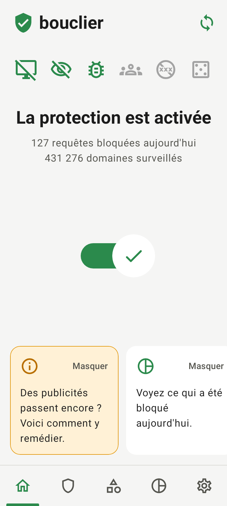

# 🛡️ Bouclier — bloqueur de publicités et de traqueurs pour Android

Bouclier bloque les publicités, les traqueurs et les sites malveillants **dans toutes les applications** du téléphone, sans root. Il fonctionne comme le mode « DNS » d'AdGuard : un VPN local filtre les requêtes DNS directement sur l'appareil.

| Protection activée | Listes de filtres | Statistiques | Thème clair |
|:---:|:---:|:---:|:---:|
|  |  |  |  |

*Captures produites automatiquement par les tests d'interface.*

## Fonctionnalités

- **Un interrupteur** pour activer la protection, et une notification permanente avec les compteurs du jour (« Bloqué : 127 · Trafic économisé : 8 Mo ») et un bouton « Désactiver ».
- **Listes de filtres reconnues**, téléchargées depuis leur source et mises à jour automatiquement (tous les deux jours, en Wi-Fi) :

  | Catégorie | Listes (✓ = activée par défaut) |
  |---|---|
  | Publicités | AdGuard DNS filter ✓, StevenBlack Unified |
  | Traqueurs | HaGeZi Multi NORMAL ✓, HaGeZi Multi PRO, traqueurs des fabricants (Samsung, Xiaomi, Huawei, Oppo/Realme, TikTok) |
  | Malwares et arnaques | HaGeZi Threat Intelligence Feeds ✓, Phishing Filter |
  | Réseaux sociaux, adultes, jeux d'argent | listes StevenBlack (désactivées par défaut) |

  Avec les réglages par défaut, environ **465 000 domaines** sont bloqués. Vous pouvez aussi ajouter n'importe quelle liste par son adresse (formats hosts, liste de domaines ou règles Adblock `||domaine^`).
- **Vos propres règles** : domaines toujours bloqués ou toujours autorisés (sous-domaines compris).
- **Exclusion d'applications** : une application qui fonctionne mal peut être retirée du filtrage.
- **Statistiques** : requêtes du jour, taux de blocage, graphique heure par heure, domaines les plus bloqués et journal des dernières requêtes. Touchez un domaine pour l'autoriser ou le bloquer.
- **Choix du serveur DNS** : celui du réseau (par défaut), Cloudflare, Quad9, Google, AdGuard DNS ou vos propres adresses.
- Démarrage automatique avec le téléphone, compatibilité avec le « VPN permanent » d'Android, thème sombre ou clair.

## Installation

1. Téléchargez `Bouclier-1.0.0-release.apk` sur le téléphone (voir [Obtenir l'APK](#obtenir-lapk)).
2. Ouvrez le fichier. Android demande d'autoriser l'installation depuis cette source : acceptez pour l'application qui a téléchargé le fichier (navigateur, Fichiers…).
3. Ouvrez Bouclier et touchez l'interrupteur. Android demande deux autorisations :
   - **Notifications** : pour afficher les compteurs ;
   - **Connexion VPN** : indispensable, c'est le VPN local qui filtre. Aucun trafic ne quitte le téléphone par ce VPN.
4. Les listes se téléchargent en quelques secondes (une petite liste intégrée protège en attendant).

> ⚠️ Android n'autorise **qu'un seul VPN à la fois**. Si AdGuard (ou un autre VPN) est actif, l'activation de Bouclier le coupe, et inversement.

Conseils pour une protection sans interruption (aussi proposés dans l'application) :

- **Paramètres › Optimisation de la batterie** : autorisez Bouclier à fonctionner en arrière-plan ;
- **Paramètres › VPN permanent** : choisissez Bouclier et activez « VPN permanent » ;
- **DNS privé** (Réglages Android › Réseau et Internet) : laissez-le sur « Automatique » ou « Désactivé ». S'il est réglé sur un nom d'hôte, les requêtes DNS contournent Bouclier ; l'application vous prévient si c'est le cas.

## Obtenir l'APK

- **Depuis GitHub Actions** : chaque modification du dossier `bouclier-android` lance le workflow *Bouclier (Android)*, qui exécute les tests puis produit l'APK (artefact `Bouclier-apk`, à télécharger depuis la page du workflow, connecté à GitHub).
- **Version publiée** : poussez une étiquette, par exemple `git tag bouclier-v1.0.0 && git push origin bouclier-v1.0.0`. Le workflow crée alors une version GitHub avec l'APK en pièce jointe, téléchargeable directement depuis le téléphone.
- **Compilation locale** : voir ci-dessous.

## Comment ça marche

```
 Application (navigateur, jeu…)           Bouclier (sur le téléphone)
 ─────────────────────────────            ─────────────────────────────────────────────
 « adresse de pub.exemple.com ? » ──DNS──▶ VPN local (seul le DNS y passe)
                                            │
                                            ├─ domaine dans une liste ? ──oui──▶ réponse « 0.0.0.0 »
                                            │                                    (la pub ne se charge pas)
                                            └─ non ──▶ vrai serveur DNS ──▶ réponse transmise telle quelle
 Le reste du trafic (pages, vidéos…) ne passe jamais par Bouclier : aucun ralentissement.
```

- Le VPN déclare un serveur DNS virtuel (`192.0.2.2`, adresse réservée à la documentation) et n'achemine que lui : Android y envoie toutes les requêtes DNS, et tout le reste emprunte le réseau normal.
- Les listes sont compilées en empreintes de 64 bits triées : moins de 4 Mo de mémoire pour 465 000 domaines, environ une microseconde par recherche.
- Un domaine bloqué l'est aussi pour tous ses sous-domaines. Priorité des règles : vos domaines autorisés, vos domaines bloqués, les exceptions des listes, puis les listes.
- Le DNS chiffré tenté automatiquement par Android (port 853) est refusé immédiatement, ce qui le fait revenir au DNS classique, filtré.

## Limites (communes à tous les bloqueurs DNS)

- **Publicités intégrées aux vidéos** (YouTube, Instagram, Facebook, Twitch) : elles viennent des mêmes serveurs que les contenus. Un bloqueur DNS ne peut pas les retirer sans casser l'application. Pour YouTube, utilisez un navigateur avec bloqueur (Firefox avec uBlock Origin, Brave…).
- **Navigateurs avec « DNS sécurisé »** (Chrome, Brave, Firefox) : si l'option est activée avec un fournisseur précis, désactivez-la.
- **Bannières vides** : l'emplacement d'une publicité bloquée peut rester visible (Bouclier ne modifie pas les pages).
- **Délai** : Android garde les adresses en cache quelques minutes. Fermez puis rouvrez l'application concernée.
- Le **trafic économisé** est une estimation : 60 Ko par requête bloquée en moyenne, comme le font les autres bloqueurs.

## Vie privée

Le filtrage se fait entièrement sur le téléphone. Bouclier n'envoie rien à un serveur qui lui appartiendrait : les seules connexions sont le téléchargement des listes (hébergées sur GitHub et GitLab) et les requêtes DNS autorisées, vers le serveur DNS choisi, comme sans Bouclier. Le journal des requêtes reste en mémoire et disparaît à l'arrêt de l'application ; seuls les compteurs sont enregistrés.

## Compiler

Prérequis : JDK 17 ou plus récent et le SDK Android (plateforme 36).

```bash
cd bouclier-android
./gradlew testDebugUnitTest   # 47 tests : paquets, DNS, listes, relais DNS, interface (Robolectric)
./gradlew assembleRelease     # app/build/outputs/apk/release/Bouclier-1.0.0-release.apk
```

Les tests d'interface enregistrent des captures dans `app/build/screenshots/`.

**Signature** : l'APK est signé avec `app/bouclier.keystore`, versionné avec le projet (mots de passe publics, comme la clé « debug » d'Android). Ainsi, toutes les compilations, locales ou sur GitHub, produisent des APK qui s'installent par-dessus les précédents. Pour publier sur un store, créez votre propre clé et gardez-la secrète.

## Organisation du code

| Dossier (`app/src/main/java/…/bouclier/`) | Rôle |
|---|---|
| `vpn/` | Service VPN, lecture de l'interface TUN, transmission au serveur DNS, notification |
| `net/` | Lecture et fabrication des paquets IPv4/UDP/TCP et des messages DNS |
| `filter/` | Catalogue des listes, analyse des formats, empreintes, téléchargement et règles |
| `stats/` | Compteurs, graphique horaire et journal |
| `data/` | Réglages |
| `ui/` | Interface Jetpack Compose (accueil, protection, applications, statistiques, paramètres) |

## Crédits et licences des listes

- [AdGuard DNS filter](https://github.com/AdguardTeam/AdGuardSDNSFilter) — GPL-3.0
- [HaGeZi DNS Blocklists](https://github.com/hagezi/dns-blocklists) — GPL-3.0
- [StevenBlack hosts](https://github.com/StevenBlack/hosts) — MIT
- [malware-filter](https://gitlab.com/malware-filter) — Phishing Filter

Les listes sont téléchargées depuis leur source et ne sont pas incluses dans l'APK. Bouclier est un projet indépendant, sans lien avec AdGuard ni avec les auteurs de ces listes.
